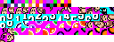
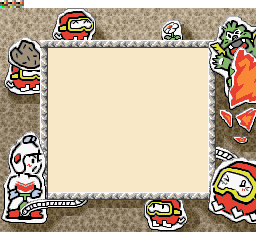

# Console Graphics Converter
[See it in action here](https://www.marcrobledo.com/console-graphics-converter)

This web app can convert a PNG image into valid retro console graphics tile data.

It is useful for console developers who prefer to store their projects' graphics as common readable and portable images that can be edited with their favorite image editing program and, then, be able to convert them to binary data easily.

**Features:**
* supported consoles: GB, GBC, SNES and NGPC
* guess palettes from images, and allows user to arrange them
* can remove duplicate tiles
* can export data as binary files or code (ASM and C)
* automatically reduces colors number in tiles that exceed the chosen console limits
* webapp, can be run under any modern web browser and OS

Code should be easily adaptable to support more consoles.

## Author's note
While developing my Game Boy Color homebrew and hacks, I got tired of outdated commandline tools that didn't exactly fulfill my needs. I was aware that there were GBC graphic editors that did the trick, but I just needed a simple solution that allowed me to keep my graphics stored as PNG images.

It was inspired by [Game Boy Tile Data Generator (gbtdg) by Chris Antonellis](https://github.com/chrisantonellis/gbtdg), which did almost everything I wanted. Soon it grew into a much more compatible and powerful tool, adding features that I missed while developing my GBC hacks.

While most of the developers are probably used to their favorite graphic editing tools, I decided to release it just in case it can be useful to anyone else.

## Embedding palette
Even if the tool guesses palettes for each tile, it is recommended to provide your own palettes by embedding checkered pattern tiles at the top of the image.

This can have many uses. Take a look at the following examples.

### Game Boy Color (4 colors per palette)

Notice the first row with the checkered tiles. 
These will tell the tool to put the magenta as the first color for the sprites (instead of letting it guess and arrange).

### Super Nintendo (16 colors per palette)

Although the original image would import correctly, in this case with a very big and complex image, it would end up with more palettes than needed (the palette quantization algorithm isn't perfect). 
By providing the three palettes, the tool guarantees the only needed three palettes will be added and ensures all tiles while use them correctly.